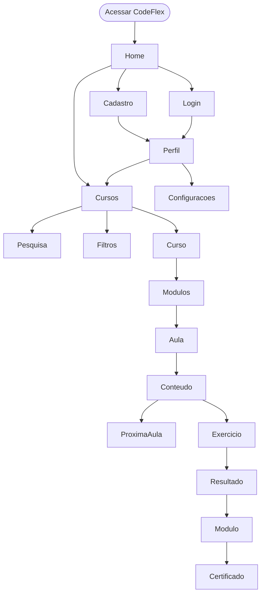
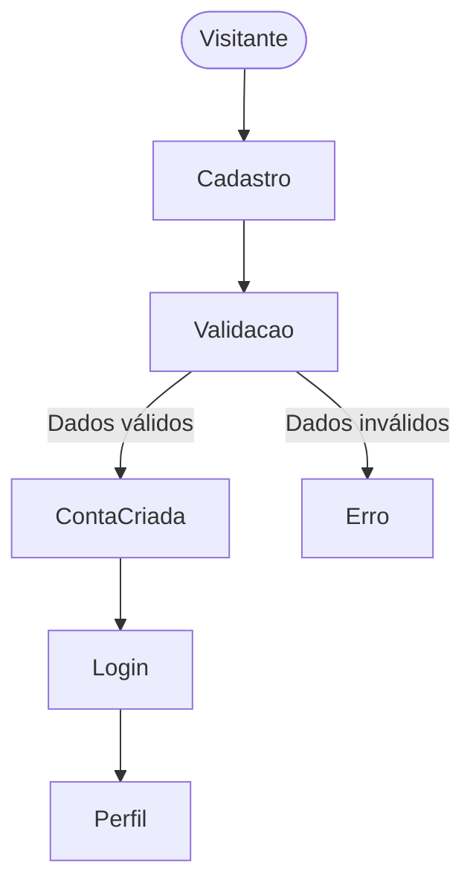
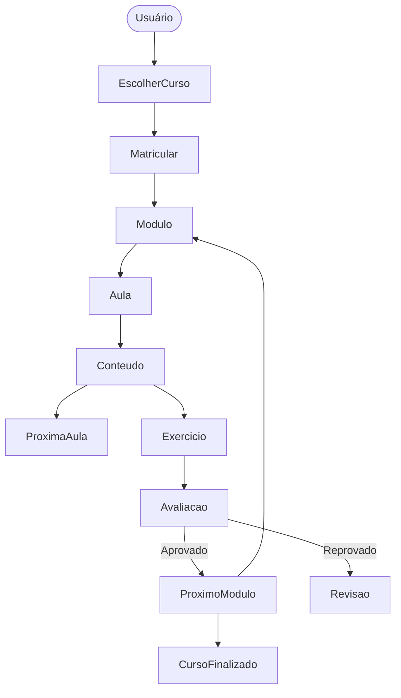
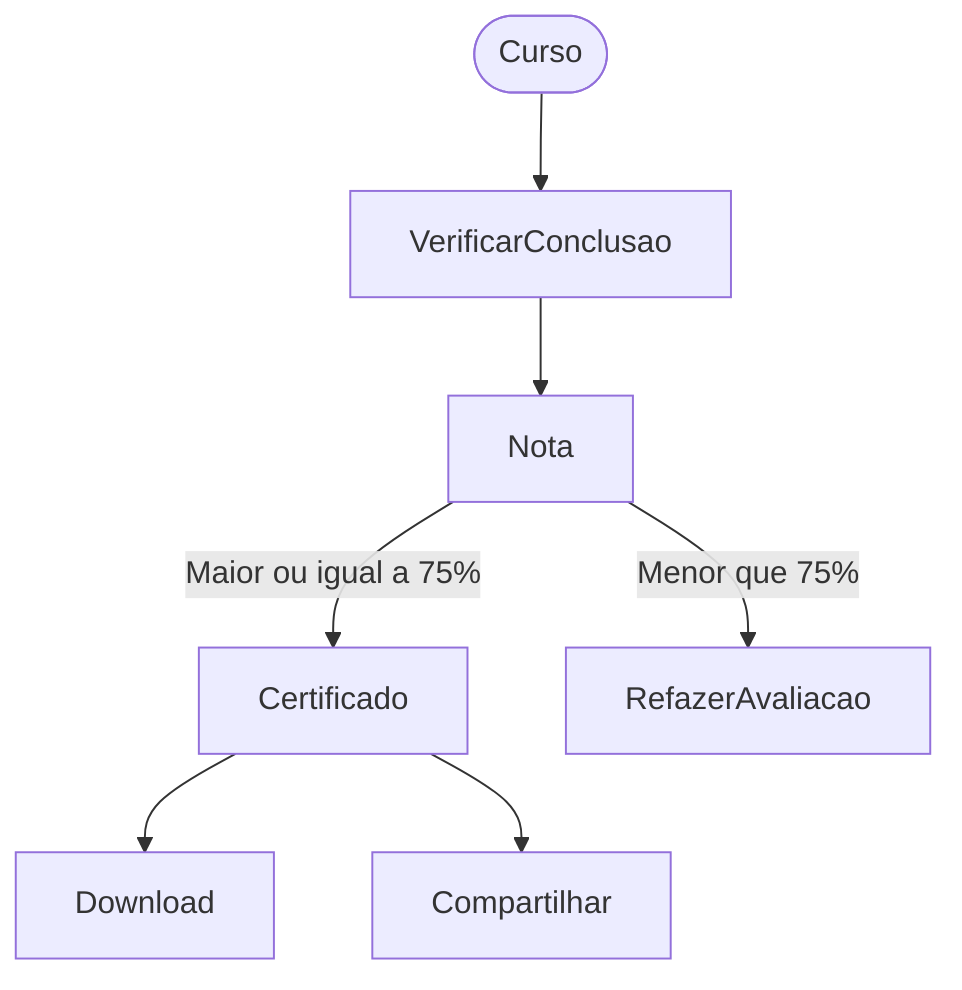
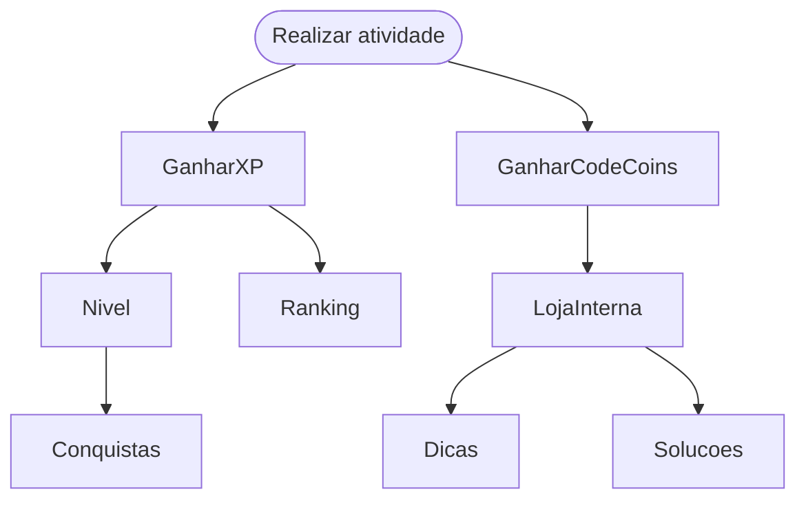
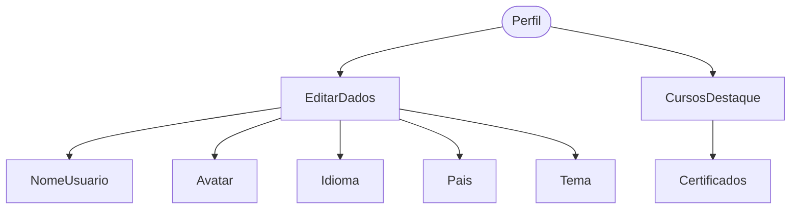
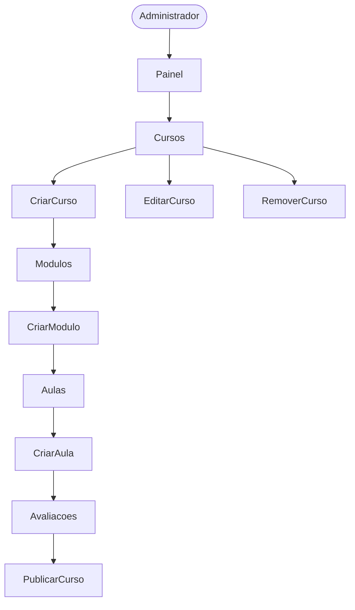
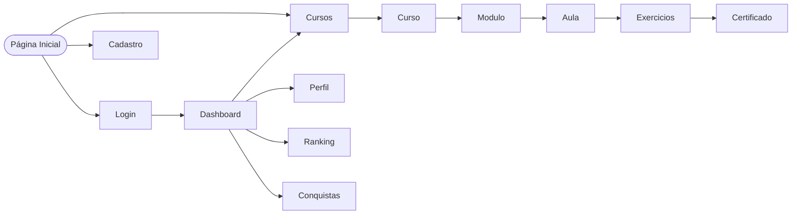

[Voltar Para o README](../README.md/#documentação)

# Fluxo de Navegação

## Introdução

Este documento descreve os principais fluxos de navegação do **CodeFlex**, representando os caminhos que os usuários podem seguir dentro da plataforma.

Os fluxos têm como objetivo facilitar o entendimento da experiência do usuário e auxiliar no desenvolvimento das interfaces do sistema.

---

# Fluxo Geral da Plataforma

---

# Fluxo de Cadastro e Acesso

---

# Fluxo de Aprendizado

---

# Fluxo de Certificação

---

# Fluxo de Gamificação

---

# Fluxo de Perfil

---

# Fluxo Administrativo

---

# Navegação Principal

---

# Regras de Navegação

Usuário não autenticado

- Pode visualizar a página inicial.
- Pode visualizar cursos disponíveis.
- Pode criar uma conta.
- Pode realizar login.

Usuário autenticado

- Pode iniciar cursos.
- Pode acompanhar progresso.
- Pode realizar avaliações.
- Pode ganhar XP e CodeCoins.
- Pode receber certificados.
- Pode editar seu perfil.

Administrador

- Possui acesso ao painel administrativo.
- Pode gerenciar cursos.
- Pode gerenciar módulos.
- Pode gerenciar aulas.
- Pode gerenciar avaliações.

---

## Estatísticas

| Tipo | Quantidade |
|------|-----------:|
| Fluxos principais | 6 |
| Diagramas Mermaid | 7 |