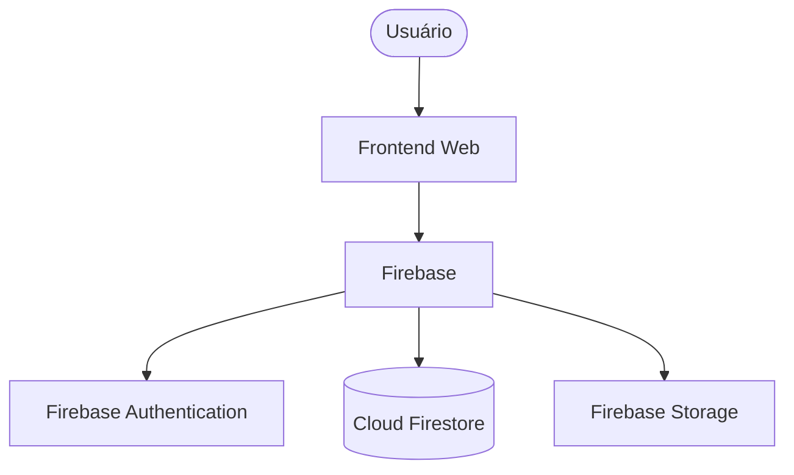
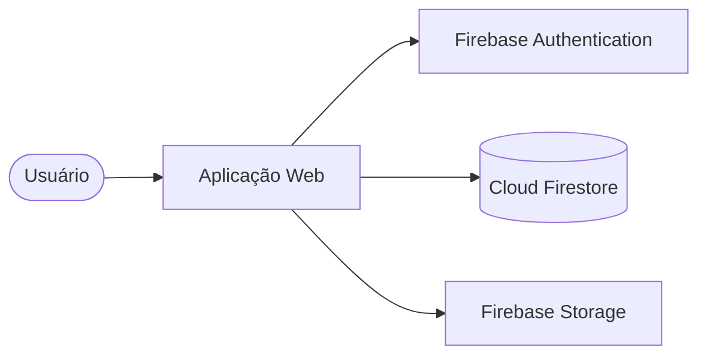

[Voltar Para o README](../README.md/#documentação)

# Arquitetura do Sistema

## Introdução

Este documento descreve a arquitetura do **CodeFlex**, apresentando a organização dos componentes da plataforma, suas responsabilidades e a comunicação entre as partes do sistema.

A arquitetura foi planejada visando baixo custo, facilidade de desenvolvimento, manutenção, escalabilidade e utilização de serviços gratuitos ou com planos iniciais gratuitos.

---

# Visão Geral da Arquitetura

O CodeFlex será desenvolvido como uma aplicação web, utilizando uma arquitetura baseada na separação entre interface do usuário, serviços da aplicação e armazenamento de dados.



---

# Tecnologias Principais

| Categoria | Tecnologia | Responsabilidade |
|---|---|---|
| Frontend | HTML | Estrutura das páginas |
| Frontend | CSS | Estilização e responsividade |
| Frontend | JavaScript | Lógica da aplicação |
| Hospedagem | GitHub Pages | Disponibilização do frontend |
| Autenticação | Firebase Authentication | Cadastro, login e gerenciamento de usuários |
| Banco de Dados | Cloud Firestore | Armazenamento das informações da plataforma |
| Armazenamento | Firebase Storage | Arquivos, imagens e certificados |

---

# Camadas do Sistema

<details>
<summary>Camada de Apresentação</summary>

Responsável pela interface visual e interação com os usuários.

Principais responsabilidades:

- Exibição dos cursos.
- Visualização das aulas.
- Perfil do usuário.
- Rankings.
- Certificados.
- Painel administrativo.
- Controle de temas e preferências visuais.

Tecnologias:

- HTML.
- CSS.
- JavaScript.

</details>


<details>
<summary>Camada de Serviços</summary>

Responsável pela comunicação entre a interface e os serviços utilizados pela plataforma.

Principais responsabilidades:

- Autenticação de usuários.
- Comunicação com o banco de dados.
- Controle de permissões.
- Atualização de progresso.
- Sistema de XP.
- Sistema de CodeCoins.
- Geração de certificados.

</details>


<details>
<summary>Camada de Dados</summary>

Responsável pelo armazenamento das informações da plataforma utilizando o Cloud Firestore.

Dados armazenados:

- Usuários.
- Cursos.
- Módulos.
- Aulas.
- Progresso.
- Avaliações.
- XP.
- CodeCoins.
- Conquistas.
- Certificados.
- Estatísticas.

</details>

---

# Banco de Dados

O CodeFlex utilizará o **Cloud Firestore** como banco de dados principal.

A escolha do Firestore foi realizada devido à sua integração com aplicações web, facilidade de implementação, escalabilidade automática e integração com serviços de autenticação e armazenamento.

A estrutura será baseada em coleções e documentos.

O modelo inicial do banco de dados será documentado em:

[07 - Modelo de Dados](./07-modelo-de-dados.md)

---

# Autenticação

O gerenciamento de usuários será realizado utilizando o Firebase Authentication.

Responsabilidades:

- Cadastro de usuários.
- Login.
- Recuperação de senha.
- Controle de sessão.
- Segurança das credenciais.

As senhas não serão armazenadas diretamente pela aplicação.

---

# Armazenamento de Arquivos

O Firebase Storage será utilizado para armazenar arquivos que não devem permanecer diretamente no banco de dados.

Exemplos:

- Avatares dos usuários.
- Certificados.
- Imagens dos cursos.
- Recursos dos conteúdos.

---

# Comunicação do Sistema



---

# Segurança

A arquitetura deverá considerar:

- Controle de acesso utilizando autenticação.
- Regras de segurança do Firestore.
- Validação dos dados enviados pelos usuários.
- Proteção das informações pessoais.
- Restrição de funções administrativas.
- Proteção contra acesso indevido aos dados.

---

# Escalabilidade

A arquitetura deverá permitir:

- Adição de novos cursos.
- Crescimento da quantidade de usuários.
- Inclusão de novos idiomas.
- Expansão dos sistemas de gamificação.
- Criação de novos tipos de conteúdo.

A utilização do Firebase permite que a infraestrutura acompanhe o crescimento da plataforma sem necessidade de gerenciamento manual de servidores.

---

# Hospedagem

O frontend da aplicação será hospedado utilizando o GitHub Pages.

Estrutura:

```text
Usuário

↓

GitHub Pages

↓

Aplicação Web

↓

Firebase
```

O GitHub Pages será responsável apenas pela disponibilização dos arquivos públicos da interface.

Os dados e serviços da aplicação serão administrados pelo Firebase.

---

# Organização do Projeto

Estrutura inicial:

```text
CodeFlex/
│
├── index.html
├── README.md
│
├── assets/
│   └── images/
│
├── docs/
│   ├── 01-visao-geral.md
│   ├── 02-requisitos.md
│   ├── 03-regras-de-negocio.md
│   ├── 04-casos-de-uso.md
│   ├── 05-fluxo-de-navegacao.md
│   ├── 06-arquitetura.md
│   ├── 07-modelo-de-dados.md
│   └── 08-tecnologias.md
│
├── license/
│   ├── LICENSE.md
│   └── CONTENT_LICENSE.md
│
└── src/
```

---

# Considerações Finais

A arquitetura do CodeFlex foi planejada para permitir um desenvolvimento inicial simples, mantendo possibilidade de evolução futura.

A utilização do Firebase reduz a complexidade inicial da infraestrutura, permitindo que o foco principal permaneça no desenvolvimento da plataforma educacional.

A arquitetura poderá ser expandida conforme novas funcionalidades sejam adicionadas ao projeto.