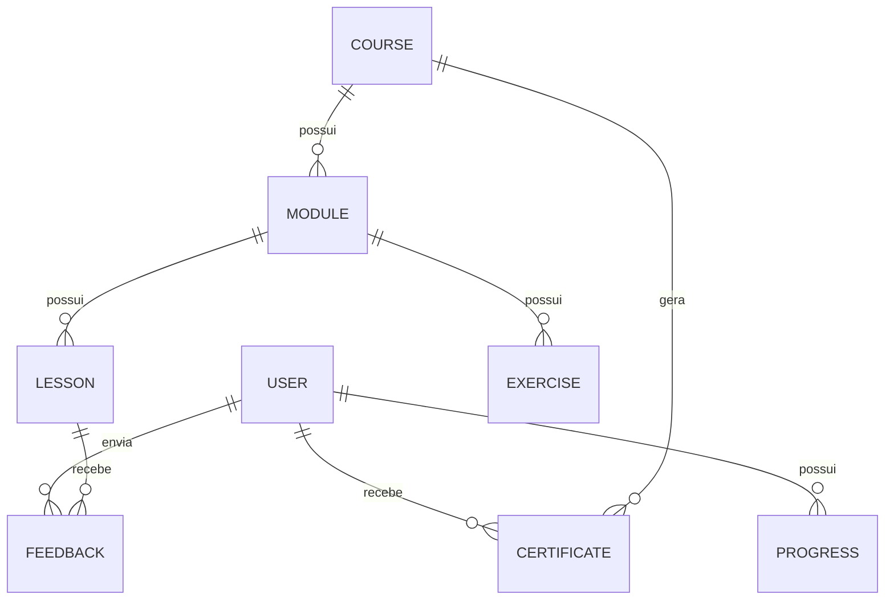

[Voltar Para o README](../README.md/#documentação)

# Modelo de Dados

## Introdução

Este documento apresenta o modelo inicial de dados do **CodeFlex**, descrevendo as principais entidades da plataforma, seus atributos e seus relacionamentos.

O objetivo deste documento é servir como base para o desenvolvimento do banco de dados, permitindo sua evolução conforme novas funcionalidades forem adicionadas ao projeto.

---

# Tecnologias

Inicialmente, a plataforma utilizará:

- Cloud Firestore
- Firebase Authentication
- Firebase Storage

Cada serviço será responsável por armazenar um tipo específico de informação da plataforma.

---

# Entidades

## Usuário

Representa um usuário cadastrado na plataforma.

| Campo | Tipo |
|------|------|
| id | String |
| username | String |
| email | String |
| biography | String |
| country | String |
| language | String |
| theme | String |
| avatar | String |
| xp | Number |
| codeCoins | Number |
| streak | Number |
| createdAt | Timestamp |

---

## Curso

Representa um curso disponível na plataforma.

| Campo | Tipo |
|------|------|
| id | String |
| title | String |
| description | String |
| category | String |
| difficulty | String |
| image | String |
| likes | Number |
| published | Boolean |

---

## Módulo

Representa um módulo pertencente a um curso.

| Campo | Tipo |
|------|------|
| id | String |
| courseId | String |
| title | String |
| order | Number |

---

## Aula

Representa uma aula pertencente a um módulo.

| Campo | Tipo |
|------|------|
| id | String |
| moduleId | String |
| title | String |
| contentType | String |
| content | String |
| order | Number |

---

## Exercício

Representa um exercício de um módulo.

| Campo | Tipo |
|------|------|
| id | String |
| moduleId | String |
| question | String |
| alternatives | Array |
| answer | Number |

---

## Certificado

Representa um certificado emitido ao usuário.

| Campo | Tipo |
|------|------|
| id | String |
| userId | String |
| courseId | String |
| grade | Number |
| issueDate | Timestamp |
| validationCode | String |

---

## Progresso

Representa o progresso do usuário em um curso.

| Campo | Tipo |
|------|------|
| id | String |
| userId | String |
| courseId | String |
| completedLessons | Array |
| currentLesson | String |
| percentage | Number |

---

## Conquista

Representa uma conquista desbloqueada pelo usuário.

| Campo | Tipo |
|------|------|
| id | String |
| title | String |
| description | String |
| icon | String |

---

## Feedback

Representa um feedback enviado por um usuário.

| Campo | Tipo |
|------|------|
| id | String |
| userId | String |
| lessonId | String |
| message | String |
| createdAt | Timestamp |

---

# Relacionamentos

- Um usuário pode possuir vários certificados.
- Um usuário pode possuir vários progressos.
- Um usuário pode desbloquear várias conquistas.
- Um curso possui vários módulos.
- Um módulo possui várias aulas.
- Um módulo pode possuir vários exercícios.
- Um certificado pertence a um único usuário.
- Um certificado pertence a um único curso.
- Um feedback pertence a um usuário e a uma aula.

---

# Diagrama Conceitual

---

# Observações

- O modelo apresentado representa apenas a estrutura inicial do banco de dados.
- Novas entidades poderão ser adicionadas durante o desenvolvimento da plataforma.
- Os nomes das coleções e documentos poderão sofrer alterações para melhor organização do projeto.